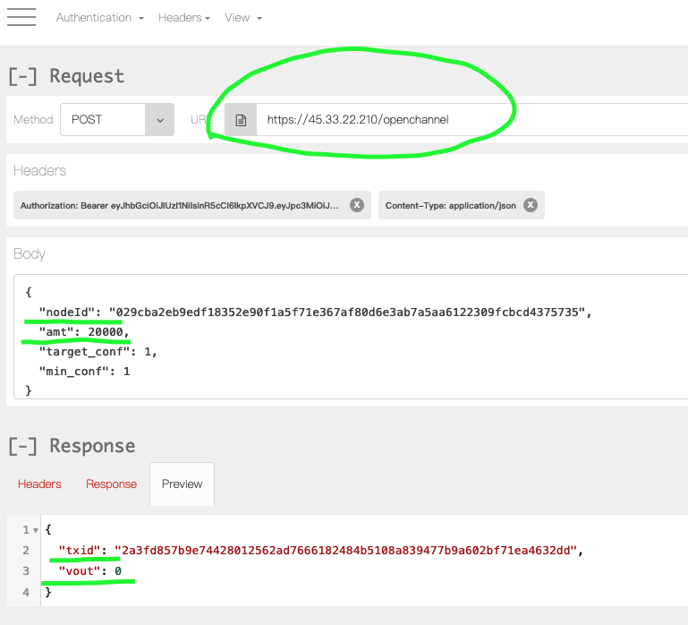
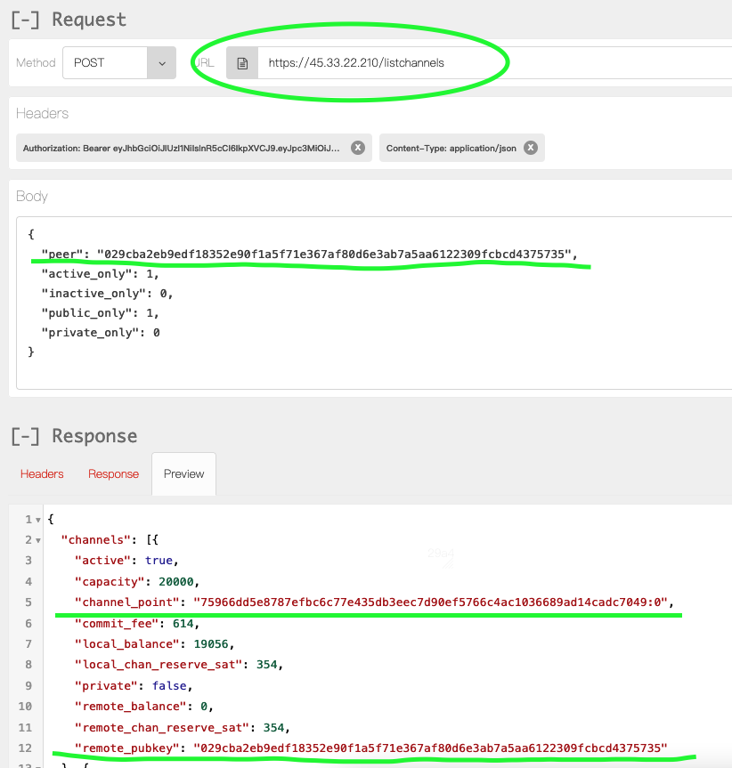
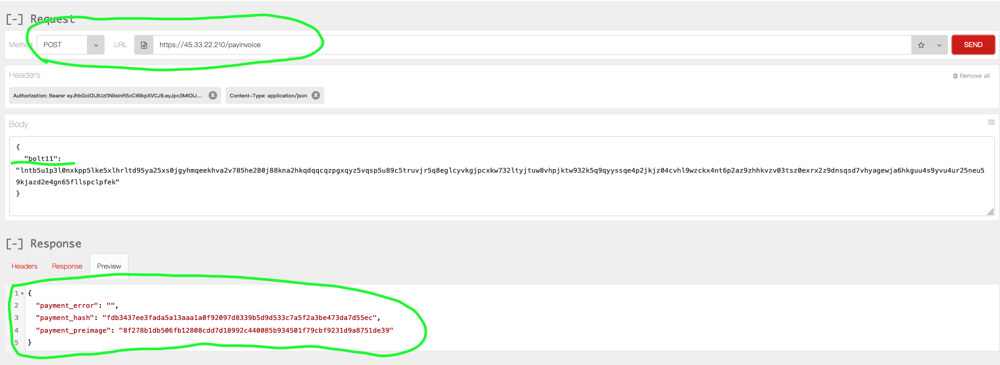

# Welcome to the VelasLightning Framework.  

A simple framework that cam be used to integrate lightning payment to your application in a none custodial way.

There are two pieces to this project.

1. A client library which uses the LDK ([Lightning Development Kit](https://lightningdevkit.org/)) and the BDK ([Bitcoin Development Kit](https://bitcoindevkit.org/)) to transform your mobile app into a light weight *lightning* node.
 
2. A REST API that communicates with a LAPP([Lightning Application](https://www.youtube.com/watch?v=8-CYfqVfa08)) to connect to peers, create channels, and process payments with a remote *full* *lightning* Node.
  - the LAPP is just a python application that communicates with the remote lighting node using [gRPC](https://www.youtube.com/watch?v=gnchfOojMk4)

# The Client library

the client library can be included in any swift project.  The VelasLightning Framework is packaged as an xcFramework.

the client library uses the LDK and BDK to turn you application into a lightweight lightning node.

included in the repo is an example project that shows how to include and use the client library into a iOS application. [Velas Lightning Example Project](https://github.com/diegovelascommerce/VelasLightning/tree/main/VelasLightningExample)

here are some videos demoing how the Velas Lightning Example Project works
   - [demo open channel](demo_create_channel.mp4)
   - [demo paying an invoice](VelasLightningInvoiceDemo.mp4)
   - [demo closing channel](demo_close_channels.mp4)
  

- this project is for demo purposes *only*.  The client is directly communicating with the REST/LAPP interface which we do not recommend.  it's not a good idea to give people an idea on where your money is located.  Also there is some information that is returned from the LAPP that you may want to record and associate with your client's account information in the backend.  Such as the nodeId to their lighting wallet and channel_points to their channels.  Also the test server for the LAPP is using a self signed certificate.  Apple might reject apps that communicate with a backend that is not signed by a certified certificate authority like VeriSign, GoDaddy, etc.
  
- rather we recommend that all communication from the client to the LAPP is done through a proxy.  that way the actual location of the remote lighting is not as easily discernable and lightning critical information about the client can be recorded in the backend and associated with your clients.  Also you can just use the TLS/SSL certificate you have setup in your backend for encrypted communication between your app and backend.
- here is an illustration of the ideal way to have the client communicate with the REST API/LAPP

# [Velas Class](https://github.com/diegovelascommerce/VelasLightning/blob/main/VelasLightningFramework/VelasLightningFramework/Velas.swift):

the client will be interacting with the lighting network through a class called [Velas](https://github.com/diegovelascommerce/VelasLightning/blob/7cec361affe799d883b0ac9afa6ad4f93c2701ed/VelasLightningFramework/VelasLightningFramework/Velas.swift#L7).

Since starting up a lightning node does take sometime because the state of the channels, peers and transactions must be synced and verified,  it is recommended to initialize the Velas class in the same startup method as your application. For example, in the AppDelegate of an iOS project.

## [Velas.Login](https://github.com/diegovelascommerce/VelasLightning/blob/70b67d025a7723794f181c100bca5338816b3fca/VelasLightningFramework/VelasLightningFramework/Velas.swift#L23)

login to the workit backend and load the bitcoin wallet and lighting node if created earlier.  

### params
- url : url to the workit server.
- username : username to account in workit
- password : password to workit account

## [Velas.Setup](https://github.com/diegovelascommerce/VelasLightning/blob/70b67d025a7723794f181c100bca5338816b3fca/VelasLightningFramework/VelasLightningFramework/Velas.swift#L89)

This is a static function that will setup velas for the first time.

### params
- plist:String? : path to a plist which contains information needed to communicate with the LAPP server.

## [Velsa.Load](https://github.com/diegovelascommerce/VelasLightning/blob/70b67d025a7723794f181c100bca5338816b3fca/VelasLightningFramework/VelasLightningFramework/Velas.swift#L53)

This function load the bitcoin wallet and lightning load if it was already setup

### params
- plist:String? : path to a plist which contains information needed to communicate with the LAPP server.

## [Velas.Check](https://github.com/diegovelascommerce/VelasLightning/blob/70b67d025a7723794f181c100bca5338816b3fca/VelasLightningFramework/VelasLightningFramework/Velas.swift#L47)

Checks if a bitcoin wallet was already setup yet

## [Velas.Connect](https://github.com/diegovelascommerce/VelasLightning/blob/70b67d025a7723794f181c100bca5338816b3fca/VelasLightningFramework/VelasLightningFramework/Velas.swift#L123)

This connects to the LAPP lightning server.

## [Velas.Connected](https://github.com/diegovelascommerce/VelasLightning/blob/70b67d025a7723794f181c100bca5338816b3fca/VelasLightningFramework/VelasLightningFramework/Velas.swift#L165)

Checks to see if Velas Lighting client is currently connected to another lighting node.

## [Velas.Peers](https://github.com/diegovelascommerce/VelasLightning/blob/70b67d025a7723794f181c100bca5338816b3fca/VelasLightningFramework/VelasLightningFramework/Velas.swift#L183)

Shows peers that the lighting node on the client side is connected to.

## [Velas.Sync](https://github.com/diegovelascommerce/VelasLightning/blob/70b67d025a7723794f181c100bca5338816b3fca/VelasLightningFramework/VelasLightningFramework/Velas.swift#L197)

update the lighting node to with the latest bitcoin block so that communications between channels go smoothly.

## [Velas.OpenChannel](https://github.com/diegovelascommerce/VelasLightning/blob/70b67d025a7723794f181c100bca5338816b3fca/VelasLightningFramework/VelasLightningFramework/Velas.swift#L211)

make a request to the LAPP to open a channel between the lighting node on the velas side and the lighting node on the LAPP side.

### params
- amt  :  amount of sats the channels should hold
- target_conf:  amount target confirmations 
- min_confs:  minimum confirmations

## [Velas.ListChannels](https://github.com/diegovelascommerce/VelasLightning/blob/70b67d025a7723794f181c100bca5338816b3fca/VelasLightningFramework/VelasLightningFramework/Velas.swift#L256) 

list channels that were setup between the velas lighting node and the LAPP lighting node.

### params
- usable : list only the channels that are usable.
- lapp: get the list of channels from the lapp.
- workit: get list of channels from workit backend.

## [Velas.PaymentRequest](https://github.com/diegovelascommerce/VelasLightning/blob/70b67d025a7723794f181c100bca5338816b3fca/VelasLightningFramework/VelasLightningFramework/Velas.swift#L289) 

### params
- amt :  amount you would like to be paid.
- description : memo you would like associated with your invoice
- workit : make the request to the workit server.
- userId : id of the user, this is used when communicating with the workit server

## [Velas.CloseChannels](https://github.com/diegovelascommerce/VelasLightning/blob/70b67d025a7723794f181c100bca5338816b3fca/VelasLightningFramework/VelasLightningFramework/Velas.swift#L315)

close all channels

### params
- force : force close channels even if one of the nodes are down

# REST API / LAPP

this handles the creation of channels and the processing of invoices through a REST/LAPP interface.

It is recommended that all calls to the REST/LAPP interface be done through a proxy.
that way the location of the lightning node will not be obvious but also make scaling  easier in the future.

here is an example of how the REST API / LAPP can be setup.

  
The backend is written in python using [Flask](https://flask.palletsprojects.com/en/2.2.x/).

It communicates with a LAPP which communicates with a remote full lighting node using [gRPC](https://grpc.io/).

for security reasons, all requests are encoded using [TLS](https://flask.palletsprojects.com/en/2.2.x/).

also for security reason, all request must have to have a JWT([Json Web Token](https://www.youtube.com/watch?v=7ozQLeFJpqs)) token in the header of the request.

we have a test server setup for experimenting with the REST/LAPP APIs.
- the server is called velastestnet and it's ip address is 45.33.22.210 
- it uses a self signed certificate for TLS.
  - however, in production it is recomended that the client communicate with a backend that  is signed with  a public certification authority like VeriSign, Digicert, etc.
  otherwise the app might be rejected by apple.

- for testing purposes the JWT token used for communicating with velastestnet(45.33.22.210) was created usings the secret phrase, literally, 'secret'.
  in production it will be expected that the jwt will be created with a much more secure secret phrase.

included in this project is an export file for a plugin called [RESTClient](https://addons.mozilla.org/en-US/firefox/addon/restclient/).
  - you can download the plugin for both Firefox or Chrome. 
  - note: we have tested these endpoints on many different machines.  the ones you want to focus on is https://45.33.22.210, the velastestnet server
  - here is the [export file for RESTClient](RESTClient_dump.json)

also we have some unit test that can be useful in showing how the api can work.  it uses [pytest](https://docs.pytest.org/en/7.2.x/).
- [unit test](https://github.com/diegovelascommerce/VelasLightning/tree/main/VelasLightningAPI/tests)
  
## `GET: getinfo`

you call this endpoint to get the information of the remote Lighting node that the LAPP is connected to.

you will need to extract information such as the identity_pubkey and the public ip address of the node so that the client can create a connection with that node

### response:

@identity_pubkey: is the node ID of the remote Lightning node that the LAPP is setup with.
- the client will need this information in order to connect to the remote full lighting node.
  
@urls.public:  this the public ip address to the remote Lighting node that the LAPP is setup with.
- the client will also need this information in order to connect the remote full lighting node.

## `POST: openchannel`

this is responsible for creating a channel between the client and the LAPP backend.

### body:

@nodeId:  node ID of the client which the LAPP will setup a channel with it's backend lightning node.
- this is the node ID of the client that is running VelasLighting Framework.  Not to be confused with the node ID of the remote Lighting node that the LAPP communicates with.

@amt:  the capacity that you want the channel to be.
- this is specified in satoshis.  

### response:
@txid:  this is the id of the transaction that was used to fund the channel.
- this can be seen in a block explorer.
  - here I am using [blockstream.info](https://blockstream.info/testnet/)
  

@vout: is the index of where the transactions in places in the block.
- you will need both the txid and the vout in order to close the channel in the future.
- it is a good idea to save this somewhere like in a table that is associated with your client's account information.

## `POST: listchannels`

returns a list of channels that the remote Full lightning node has setup.

### body:
@peer:  the node ID which you want to see channels for.
- if you leave this blank it will return to you all the channels you have setup in your remote full lightning node

### response:
@channel_point: this is a combination of the txid and the vout.
- you will need to provide this information if you want to close the channel in the future.

### `POST: closechannel`

this is used to close a channel

- you would probably use this to close the channels on behalf of a client, in case they lost their phone.

### body:
@txid:  the id of the transaction that was used to fund this channel
@vout:  the index in the block that the funding transaction was added to.

### response:
@txid:  the id of the transaction that give participants back their money
- you can see this transaction on a block explorer.  
  

## `POST: payinvoice`

this is used to pay an invoice that the client generated.
- example: client reached their goal and generated a bolt11 using `velas.createInvoice`
- the bolt11 gets processed by the lapp and now the user balance reflects that.

### body:
@bolt11: this is the bolt11 string that was generated by the client.

### response:
@payment_error:  if there were any errors, this field would have a message explaining the problem

@payment_hash:  this is a hash that is used in [HTLC](https://www.youtube.com/watch?v=NcKNzk-H8CY).

@payment_preimage:  this is the preimage that generated the HASH for the [HTLC](https://www.youtube.com/watch?v=NcKNzk-H8CY).
- if the payment was successful this field should be filled