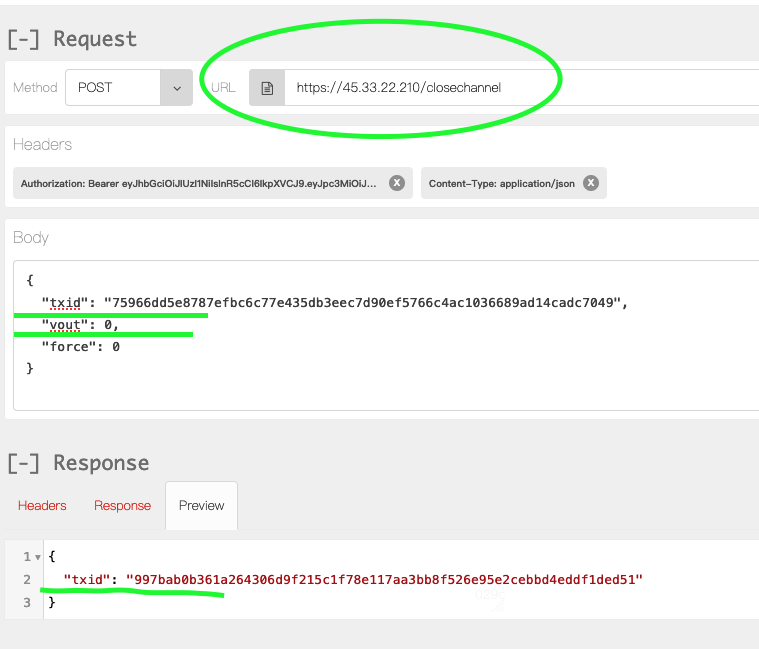
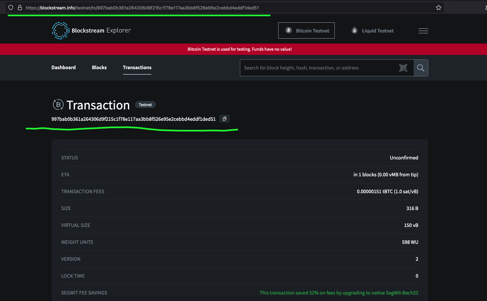

Welcome to the VelasLightning Framework.  
A simple framework that cam be used to integrate lightning payment to your application in a none custodial way.

There are Two Major peaces to this project.

1. A client side which uses the LDK ([Lightning Development Kit](https://lightningdevkit.org/)) and the BDK ([Bitcoin Development Kit](https://bitcoindevkit.org/)) to transform you mobile app into a light weight Lightning node.
2. A REST API that communicates with a LAPP([Lightning Application](https://lightningdevkit.org/)) for creating an managing peers, channels, payments, etc, with a remote Full Lightning Node.
  - the LAPP is just a python application that communicates with a Lighting Node using [gRPC](https://www.youtube.com/watch?v=gnchfOojMk4)

# The Client 

the client side is packaged as a library that can be included in your application.
- for example in iOS, the VelasLightning Framework is packaged as an xcFramework.

the client uses the LDK and BDK to turn you application into a lightweight lightning node.

it can connect to another lightning peer.

it can make a request to the LAPP to create an inbound channel with it.

it can create bolt11 invoices and submit it to the LAPP for processing to receive money.

it can list the channels it has open.

it can also close channels that is has setup through the LAPP

included in the repo is an example project that show how to include and use the client side of the VelasLightning Framework in a iOS application. [Velas Lightning Example Project](https://github.com/diegovelascommerce/VelasLightning/tree/main/VelasLightningExample)
  - this project is for demo purposes only, the client directly communicates with the LAPP which we don't recommend.  it's not a good idea to give people and idea on where your money is located.
  - rather we recommend that all communication from the client to the LAPP is done through a proxy.  that way the actual location of the remote lighting is not as easily discernable.   
  - here is an example of the ideal way to have the client communicate with the REST API/LAPP
  

## Velas Class:

the client will be interacting with the lighting network through a class called Velas.

this must be initialized and synced with the lighting network before you can begin to use it.

since starting up a lightning node does take sometime because the state of the channels must be synced with the peers they are setup wit.  it is recommended to initialize the Velas class in the same startup method as your application. For example, in the AppDelegate of an iOS project.
- however you can start the Velas Class anywhere you like just keep in mind that it take a while to sync and it would be a good idea to keep the instance of the Velas class as a global static variable, that way you only have to initialize it once during the lifetime of the application.

### Methods:

the Velas has the following methods for interacting with the Lightning network

#### `init(network: Network = Network.testnet, mnemonic: String? = nil) throws`

- this is the method that will initialize the Velas Class.  

- the mnemonic is passed over to the BDK which creates the private key of your wallet.  Then it passes the private key to the LDK so that it can create a node associated with you public keys.
  
- here is an example of how to initialize the Velas Class in the appDelegate.
  [Velas Class init example](https://github.com/diegovelascommerce/VelasLightning/blob/9fe0f7e9275c5ffad363829773bd2bceb091cd3d/VelasLightningExample/VelasLightningExample/AppDelegate.swift#L22)
    - notice that the Velas object is saved to a global variable of the project.
    - you don't have to do it this way.  if you are using a dependency management framework you can setup it up as a static scoped object.

@network:
- what blockchain network do you want the velas object to work with.
  - by default it is set to testnet, which is just a testing network.  No real money is used.

@mnemonic:
- this is mnemonic phrase used to create the private key for your bitcoin wallet.
  - this should be saved on the users device.
    - note: if this phrase is lost the user will note be able get their funds.
      it is important that in addition to saving this phrase on the device that the user writes it down somewhere so that in case he or she loses his phone they can reclaim there funds in another bitcoin wallet.

#### `getNodeId() throws -> String`

- this method returns the lightning network nodeId of the client.
  - this information is important when making a request to create a channel through the LAPP.
  - this should be saved in a data base and associated with the client.
  - if you want to see the channels associated with your client you will need the nodeId.

#### `connectToPeer(nodeId: String, address: String, port: NSNumber) throws -> Bool`

- this method connects the client to another lightning node.
  - before you create channels and submit invoices with another lighting node you have to   connect to it.
  - to make a connection you will need the nodeId, address, and port of the other lighting node you want to connect to.

@nodeId: nodeId of the node you want to connect with in the lighting network.

@address:  ip address of the node you want to connect to

@port: the port in which the node is setup to listen for peer requests

@returns:  true is connections was a success, false if connection did not go through.

#### `listPeers() throws -> [String]`

- list the peers that client is connected to
  - you need to be actively connected to a peer if you want to do anything in the lightning network

@returns: an array of strings representing peers that client is connected to.

#### `listChannelsDict() throws -> [[String:Any]] `

- list channels that client has setup.
- note:  the client does not have the ability to create outbound channels yet.  
  - since, the client has no liquidity/funds when they first start they can not create a channel
  - It can only request that the LAPP create an inbound channel with it.

@returns:  an array of dictionaries that have information on each channel that you have setup.

#### `createInvoice(amtMsat: Int, description: String) throws -> String`

- this creates an bolt11 invoice.
  - to receive money, you would need to create a bolt11 invoice.
    - it would look something like this: 
    lnbc2500u1pvjluezpp5qqqsyqcyq5rqwzqfqqqsyqcyq5rqwzqfqqqsyqcyq5rqwzqfqypqdq5xysxxatsyp3k7enxv4jsxqzpuaztrnwngzn3kdzw5hydlzf03qdgm2hdq27cqv3agm2awhz5se903vruatfhq77w3ls4evs3ch9zw97j25emudupq63nyw24cg27h2rspfj9srp
  - you would then submit this to the lapp to receive money.
  
@amtMsat:  amount you want to be paid in milisatoshis(1000 of a a satoshi)

@description: a description you would like to attach to this invoice.

#### `closeChannelsCooperatively() throws`

- this allows you to close all the cooperatively, this mean you were able to negotiate with the other peer you are connected with and you can both get your share of the channel near instantly.

#### `closeChannelsForcefully() throws`

- this allows you to close all your channels forcefully, this usually because the other peer was not online to negotiate when to close the channel.
- this is usual considered the bad way to close a channel be cause sometimes you have to wait 2016 block on the blockchain before you can get your money.

# REST API / LAPP

the creation of channels and processing of invoices are handled through the REST API/ LAPP.

It is recommended that all calls to the REST API / LAPP interface be done through a proxy.
- that way the location of the lightning node will not be obvious but also make scaling  easier in the future.
- here is an example of how the REST API / LAPP can be setup.
- 
  

The backend is writen in python using [Flask](https://flask.palletsprojects.com/en/2.2.x/).

It communicated with a LAPP which communicates with a remote full lighting node using gRPC.

## REST API endpoints

for security reasons, all requests are encoded using [TLS](https://flask.palletsprojects.com/en/2.2.x/).

- the test server for demoing these endpoints is velastestnet(45.33.22.210) 
  - it uses a self signed certificate.
- however, in production the client needs to communicate with a backend that is signed with  a public certification authority.
  otherwise the app might be rejects by apple.

also for security reason, all request have to have a JWT([Json Web Token](https://www.youtube.com/watch?v=7ozQLeFJpqs)) token in the header of the request.
- for testing purposes the JWT used for communicating with velastestnet(45.33.22.210) was created usings the secret phrase, literally, 'secret'.
  in production it will be expected that the jwt will be created with a much more secure secret phrase.

- attached is an export of all the endpoints that be used for testing with a browser plugin called [RESTClient](https://addons.mozilla.org/en-US/firefox/addon/restclient/).
  - you can download the plugin for both Firefox or Chrome. 
  - we have tested these endpoints on many different machines.  the ones you want to focus on is https://45.33.22.210
  
#### `GET: getinfo`

you call this endpoint to get the information of the remote Lighting node that the LAPP is connected to.

@identity_pubkey: is the node ID of the remote Lightning node that the LAPP is setup with.
- the client will need this information in order to connect to the remote full lighting node.
  
@urls.public:  this the public ip address to the remote Lighting node that the LAPP is setup with.
- the client will also need this information in order to connect the remote full lighting node.

#### `POST: openchannel`

this is responsible for creating a channel on the clients behalf.

- because when the client first starts up, it does not have any Funds/Liquidity to open a channel.
- also because for workit, the client is receiving funds therefor it's the LAPP job to create a outbound channel to the client.

@nodeId:  node ID of the client which the LAPP will setup a channel with on it's behalf.
- this is the node ID of the client that is running VelasLighting Framework.  Not to be confused with the node ID of the remote Lighting node that the LAPP communicates with.

@amt:  the capacity that you want the channel to be.
- this is specified in satoshis.  

@txid:  this is the id of the transaction that was used to fund the channel.
- this can be seen in a block explorer.
  - here I am using [blockstream.info](https://blockstream.info/testnet/)
  - 

@vout: is the index of where the transactions in places in the block.
- you will need both the txid and the vout in order to close the channel in the future.
- it is a good idea to save this somewhere like in a table that is associated with your clients.

#### `POST: listchannels`

returns a list of channels that the remote Full lightning node has setup.

@peer:  the node ID which you want to see channels for.
- if you leave this blank it will return to you all the channels you have setup in your remote full lightning node

@channel_point: this is a combination of the txid and the vout.
- you will need to provide this information if you want to close the channel.

#### `POST: closechannel`

this is used to close a channel

- you would probley use this to close the channels on behalf of a client, in case they lost their phone.

##### body
@txid:  the id of the transaction that was used to fund this channel
@vout:  the index in the block that the funding transaction was added to.

##### result
@txid:  the id of the transaction that give participants back their money
- you can see this transaction on a block explorer.  
  

#### `POST: payinvoice`

this is used to pay an invoice that the client generated.
- example: client reached their goal and generated a bolt11 using `velas.createInvoice`
- the bolt11 gets processed by the lapp and now the user balance reflects that.

##### body
@bolt11: this is the bolt11 string that was generated by the client.

##### response
@payment_error:  if there were any errors, this field would have a message explaining the problem

@payment_hash:  this is a hash that is used in HTLC.

@payment_preimage:  this is the preimage that generated the HASH.
- if the payment was successful this field should be filled