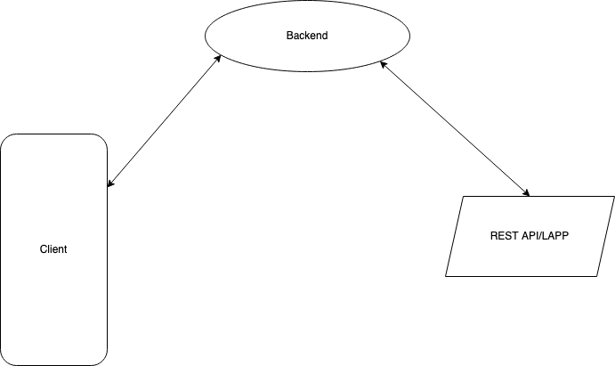
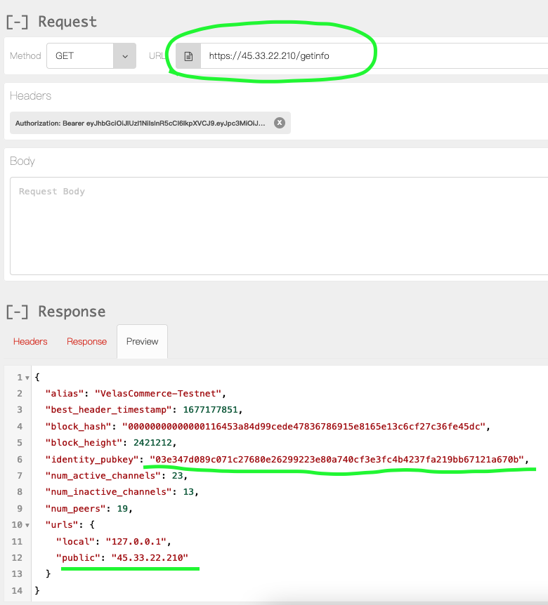
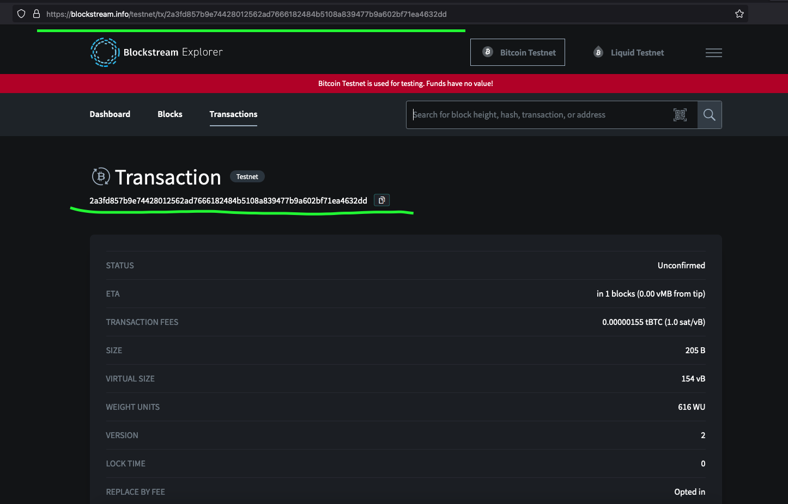
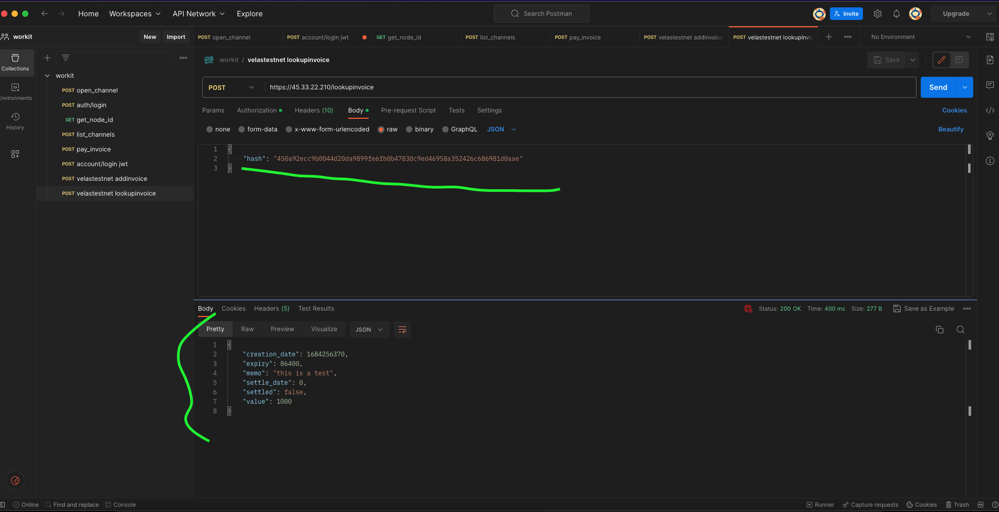

This is the part that handles the creating of channels and processing of invoices.
A client will communicate with the server side to request that outbounded channels be created to it submit bolt11 invoices to collect their rewards

# REST API / LAPP

this handles the creation of channels and the processing of invoices through a REST/LAPP interface.

It is recommended that all calls to the REST/LAPP interface be done through a proxy.
that way the location of the lightning node will not be obvious but also make scaling  easier in the future.

here is an example of how the REST API / LAPP can be setup.

  
The backend is written in python using [Flask](https://flask.palletsprojects.com/en/2.2.x/).

It communicates with a LAPP which communicates with a remote full lighting node using [gRPC](https://grpc.io/).

for security reasons, all requests are encoded using [TLS](https://flask.palletsprojects.com/en/2.2.x/).

also for security reason, all request must have to have a JWT([Json Web Token](https://www.youtube.com/watch?v=7ozQLeFJpqs)) token in the header of the request.

we have a test server setup for experimenting with the REST/LAPP APIs.
- the server is called velastestnet and it's ip address is 45.33.22.210 
- it uses a self signed certificate for TLS.
  - however, in production it is recomended that the client communicate with a backend that  is signed with  a public certification authority like VeriSign, Digicert, etc.
  otherwise the app might be rejected by apple.

- for testing purposes the JWT token used for communicating with velastestnet(45.33.22.210) was created usings the secret phrase, literally, 'secret'.
  in production it will be expected that the jwt will be created with a much more secure secret phrase.

included in this project is an export file for a plugin called [RESTClient](https://addons.mozilla.org/en-US/firefox/addon/restclient/).
  - you can download the plugin for both Firefox or Chrome. 
  - note: we have tested these endpoints on many different machines.  the ones you want to focus on is https://45.33.22.210, the velastestnet server
  - here is the [export file for RESTClient](RESTClient_dump.json)

also we have some unit test that can be useful in showing how the api can work.  it uses [pytest](https://docs.pytest.org/en/7.2.x/).
- [unit test](https://github.com/diegovelascommerce/VelasLightning/tree/main/VelasLightningAPI/tests)
  
## `GET: getinfo`

you call this endpoint to get the information of the remote Lighting node that the LAPP is connected to.

you will need to extract information such as the identity_pubkey and the public ip address of the node so that the client can create a connection with that node

### response:

@identity_pubkey: is the node ID of the remote Lightning node that the LAPP is setup with.
- the client will need this information in order to connect to the remote full lighting node.
  
@urls.public:  this the public ip address to the remote Lighting node that the LAPP is setup with.
- the client will also need this information in order to connect the remote full lighting node.

## `POST: openchannel`

this is responsible for creating a channel between the client and the LAPP backend.

### body:

@nodeId:  node ID of the client which the LAPP will setup a channel with it's backend lightning node.
- this is the node ID of the client that is running VelasLighting Framework.  Not to be confused with the node ID of the remote Lighting node that the LAPP communicates with.

@amt:  the capacity that you want the channel to be.
- this is specified in satoshis.  

### response:
@txid:  this is the id of the transaction that was used to fund the channel.
- this can be seen in a block explorer.
  - here I am using [blockstream.info](https://blockstream.info/testnet/)
  

@vout: is the index of where the transactions in places in the block.
- you will need both the txid and the vout in order to close the channel in the future.
- it is a good idea to save this somewhere like in a table that is associated with your client's account information.

## `POST: listchannels`

returns a list of channels that the remote Full lightning node has setup.

### body:
@peer:  the node ID which you want to see channels for.
- if you leave this blank it will return to you all the channels you have setup in your remote full lightning node

### response:
@channel_point: this is a combination of the txid and the vout.
- you will need to provide this information if you want to close the channel in the future.

### `POST: closechannel`

this is used to close a channel

- you would probably use this to close the channels on behalf of a client, in case they lost their phone.

### body:
@txid:  the id of the transaction that was used to fund this channel
@vout:  the index in the block that the funding transaction was added to.

### response:
@txid:  the id of the transaction that give participants back their money
- you can see this transaction on a block explorer.  
  

## `POST: payinvoice`

this is used to pay an invoice that the client generated.
- example: client reached their goal and generated a bolt11 using `velas.createInvoice`
- the bolt11 gets processed by the lapp and now the user balance reflects that.

### body:
@bolt11: this is the bolt11 string that was generated by the client.

### response:
@payment_error:  if there were any errors, this field would have a message explaining the problem

@payment_hash:  this is a hash that is used in [HTLC](https://www.youtube.com/watch?v=NcKNzk-H8CY).

@payment_preimage:  this is the preimage that generated the HASH for the [HTLC](https://www.youtube.com/watch?v=NcKNzk-H8CY).
- if the payment was successful this field should be filled

## `POST: addinvoice`

this is used to create an invoice for someone to pay to the workit Lightning wallet.
you might use in the case the user would like to contribute of a pot lot / groupoun service that you are offering.

### body:
@memo:  you can attach a memo to the invoice you are creating.

@amount:  the amount in satoshis you would like the invoice to be.

### response:
@payment_hash:  the hash associated with the bolt11.  you will need this if you want to track the status of the invoice latter.

@payment_request: this is the actual bolt11 invoice that you want to share.

## `POST: lookupinvoice`

this is used to find out what it is the status of the invoice you created with `/addinvoice`.

### body:
@hash:  this is the hash that came with the invoice you created with `/addinvoice`

### response:
@creation_data:  when the invoice was created.  it's in unix time

@memo:  memo that you created with the invoice.

@expiry:  time in seconds when bolt11 invoice will expire.

@settled_data:  the time when the bolt11 invoice was paid.

@settled:  boolean telling if bolt11 invoice was paid yet

@value: the amount of the invoice 
